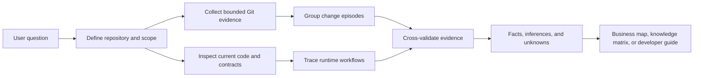

# Git Project Intelligence

[简体中文](README.md) | [English](README.en.md)

`git-project-intelligence` is a Codex skill for analyzing Git repositories. It combines current code, commit history, tests, configuration, and documentation into verifiable evidence to reconstruct project architecture, business workflows, technical decisions, contributor knowledge distribution, and the fit of product or technical proposals with an existing codebase.

Its purpose is not to produce a commit-count leaderboard. It is designed to answer more useful engineering questions:

- Where should a developer start reading an unfamiliar project, and how do its core modules collaborate?
- Which states and boundaries does a business capability cross from a UI, API, or job trigger to its final side effect?
- Why did a change touch particular modules, and does the current code still preserve that design?
- Which contributors have observable historical experience in a subsystem, and where is knowledge overly concentrated?
- How does a contributor typically locate entry points, define change boundaries, preserve compatibility, and validate results?
- Should a new requirement be implemented directly, adjusted, validated first, or rejected because it conflicts with existing constraints?
- Which files should the next developer change, which invariants must remain intact, and which tests need extension?

> Git is historical evidence, not complete truth. This skill separates facts, inferences, and unknowns, and requires material conclusions to cite commits, paths, symbols, or reproducible commands.

## Core Capabilities

### Project and Architecture Understanding

- Inventory top-level modules, build manifests, runtime entry points, dependency injection, domain models, persistence, external adapters, and tests.
- Reconstruct present runtime behavior from current code and use Git history to supplement design intent and evolution.
- Group related commits into coherent change episodes instead of mechanically listing individual commits.
- Use Mermaid sequence and flow diagrams to explain component interactions, decisions, failures, and fallback paths.

### Business Entry-Point Discovery

- Expand user-facing product language into actors, entities, actions, states, errors, UI copy, API fields, events, and configuration keys.
- Search current code, filenames, commit messages, and historical diffs together.
- Rank candidate entry points by evidence convergence across UI/API, domain state, persistence, side effects, and tests, rather than raw match count.
- Explain what a business term means in the repository, trace its end-to-end workflow, identify adjacent concepts, and record unresolved questions.

### Contributor and Team Knowledge Analysis

- Assess observable contributor knowledge by subsystem as `deep`, `working`, `adjacent`, or `insufficient evidence`.
- Combine change breadth, repeated depth, lifecycle coverage, recency and continuity, cross-module integration, and current-code survival.
- Analyze module boundaries, dependency order, compatibility strategy, failure handling, and validation practices across representative change episodes.
- Identify repository risks such as knowledge concentration, single-maintainer areas, weak testing, and unclear ownership.

This capability describes **engineering experience observable in the repository**. It is not a complete measure of an individual's abilities, current organizational responsibility, or availability. Commit counts are never used to infer productivity, seniority, personality, or motivation.

### Proposal and Requirement Assessment

- Reconstruct the current workflow before comparing the state, contract, platform, data, and operational changes introduced by a requirement.
- Evaluate architecture fit, correctness, compatibility, reliability, security, performance, testability, maintenance cost, and reversibility.
- Classify product requirements as `fits`, `fits with adjustments`, `validate first`, or `conflicts`.
- Classify historical technical solutions as `sound`, `viable with tradeoffs`, `fragile or context-dependent`, `superseded`, or `insufficient evidence`.
- Recommend the smallest reversible experiment, acceptance criteria, regression surface, rollout boundary, and rollback boundary.

### Development Navigation

- Identify likely code entry points, owning modules, call and data flow, and analogous historical implementations.
- State invariants, compatibility constraints, tests to extend, and commands to run.
- Convert findings into a minimal implementation sequence with explicit risk checkpoints.

## How It Works



The analysis follows two priorities:

1. **Current behavior comes from current code.** Entry points, state changes, failure paths, and side effects must be confirmed in the present implementation and tests.
2. **Intent and evolution come from historical evidence.** Commit messages, diffs, parent revisions, and follow-up fixes can explain changes, but they do not override current code.

When the two disagree, the report should state the discrepancy and its consequences explicitly.

## Repository Layout

```text
git-project-intelligence/
├── SKILL.md
├── README.md
├── README.en.md
├── agents/
│   └── openai.yaml
├── references/
│   ├── business-product-analysis.md
│   ├── contributor-engineering-analysis.md
│   └── report-contract.md
└── scripts/
    ├── collect_git_evidence.py
    └── find_business_context.py
```

| Path | Purpose |
| --- | --- |
| `SKILL.md` | Skill entry point defining use cases, evidence rules, workflow, and output modes. |
| `agents/openai.yaml` | Display name, short description, and default prompt for the Codex interface. |
| `references/report-contract.md` | Section structure and evidence notation for full repository and team reports. |
| `references/business-product-analysis.md` | Rules for business keyword expansion, entry-point ranking, and product-fit assessment. |
| `references/contributor-engineering-analysis.md` | Rules for contributor knowledge, technical decisions, module-change strategies, and solution feasibility. |
| `scripts/collect_git_evidence.py` | Produces JSON containing bounded, read-only commit, author, file-frequency, and numstat evidence. |
| `scripts/find_business_context.py` | Uses `rg` and Git history to find code, files, and commits associated with business keywords. |

## Requirements

- Git
- Python 3.8 or later; the scripts use only the standard library
- [ripgrep](https://github.com/BurntSushi/ripgrep), required only by `find_business_context.py`
- A Codex environment that supports local skills

Both helper scripts only read the target Git repository. They write only when `--output` is supplied, and only to the requested JSON path. They do not modify the target repository, switch branches, or create commits.

## Installation

Place this repository in the Codex personal skills directory and keep the directory name `git-project-intelligence`:

```bash
git clone https://github.com/skeyboy/git-project-intelligence.git \
  ~/.codex/skills/git-project-intelligence
```

After opening a new Codex session, invoke the skill explicitly in a prompt:

```text
Use $git-project-intelligence to analyze the current repository and give me a quick orientation for a new developer.
```

You can also ask a question that matches the skill description. Explicitly naming `$git-project-intelligence` makes it easier to confirm that Codex is using this skill and its evidence rules.

If the repository is already checked out elsewhere, create a symbolic link:

```bash
ln -s /absolute/path/to/git-project-intelligence \
  ~/.codex/skills/git-project-intelligence
```

## Quick Start

Open Codex in the Git repository you want to analyze, then choose a prompt that matches your goal.

### 1. Orient Yourself in an Unfamiliar Project

```text
Use $git-project-intelligence to analyze the current branch. Provide an architecture map,
one core runtime workflow, high-risk or high-churn areas, and the first files a new developer
should read. Separate facts, inferences, and unknowns.
```

### 2. Trace the Runtime Effect of a Change

```text
Use $git-project-intelligence to analyze commit <commit>. Explain its change episode,
affected modules, runtime call order, state and failure paths, relevant tests, follow-up fixes,
and survival in current code. Include Mermaid sequence and flow diagrams.
```

### 3. Locate Business Code from Product Language

```text
Use $git-project-intelligence to find the business entry points for "automatic renewal."
Trace the workflow from its UI or API trigger through domain state, persistence, and external
side effects. Rank the 3-7 most important entry points, tests, and representative commits,
and explain any remaining ambiguity.
```

### 4. Analyze Team Knowledge Distribution

```text
Use $git-project-intelligence to analyze contributor knowledge distribution over the last
18 months. Exclude bots, merges, generated files, and formatting-only changes. Provide
qualitative subsystem coverage and confidence, and identify concentration risks without
evaluating people by commit count.
```

### 5. Analyze a Contributor's Module-Change Strategy

```text
Use $git-project-intelligence to analyze <author>'s engineering practices in the payment
module. Sample at least three complete change episodes and describe entry-point discovery,
module boundaries, sequencing, compatibility, failure handling, tests, and follow-up fixes.
Include counterexamples, sample scope, and confidence. Do not infer personality or motives.
```

### 6. Evaluate a New Requirement

```text
Use $git-project-intelligence to assess whether "<requirement>" fits the current project.
Reconstruct the existing workflow first, then return fits / fits with adjustments /
validate first / conflicts. Explain evidence, counterevidence, assumptions, the smallest
reversible experiment, acceptance criteria, regressions, and likely code entry points.
```

### 7. Build a Development Navigation Packet

```text
Use $git-project-intelligence to create a developer packet for "<feature or bug>."
Include entry files and symbols, end-to-end call and data flow, analogous commits, invariants,
tests to extend, verification commands, and a staged implementation sequence.
```

## Helper Scripts

The skill normally invokes the scripts as part of evidence collection. You can also run them directly for debugging, auditing, or integration with another tool.

### `collect_git_evidence.py`

Collects a bounded commit set for a revision and summarizes authors, file-touch frequency, per-commit numstat, and basic repository metadata.

```bash
python3 scripts/collect_git_evidence.py \
  --repo /path/to/repository \
  --revision main \
  --since 2025-01-01 \
  --until 2025-12-31 \
  --path src/payments \
  --path tests/payments \
  --max-commits 1000 \
  --top 30 \
  --output /tmp/git-evidence.json
```

| Option | Default | Description |
| --- | --- | --- |
| `--repo` | `.` | Any path inside the target repository; the script resolves the repository root. |
| `--revision` | `HEAD` | Revision to analyze: branch, tag, or commit. |
| `--since` | none | Start time passed to `git log --since`. |
| `--until` | none | End time passed to `git log --until`. |
| `--path` | none | Path filter; may be supplied more than once. |
| `--max-commits` | `2000` | Maximum number of commits, clamped to at least one. |
| `--top` | `50` | Maximum author top-file and global hot-file entries. |
| `--output` | stdout | JSON output path. |

Top-level output fields include:

- `repository`, `revision`, `head`, `branch`, and `shallow`
- `filters` and the collected `commit_count`
- `authors`: unmerged author identities and their frequently touched files
- `hot_files`: files appearing most often in the sampled commits
- `commits`: commit metadata and per-file added/deleted line counts
- `caveats`: fixed limitations covering aliases, rename detection, and line-count interpretation

To keep collection bounded and deterministic, rename detection is explicitly disabled. Binary-file line counts are recorded as zero. Author aliases, bots, generated files, and mechanical changes must be identified during later analysis; raw statistics cannot support conclusions about individuals.

### `find_business_context.py`

Searches current code, filenames, commit messages, and diff content for one or more business keywords.

```bash
python3 scripts/find_business_context.py \
  --repo /path/to/repository \
  --keyword "subscription" \
  --keyword "renewal" \
  --revision main \
  --max-files 40 \
  --max-commits 50 \
  --samples-per-file 3 \
  --output /tmp/business-context.json
```

| Option | Default | Description |
| --- | --- | --- |
| `--repo` | `.` | Any path inside the target repository. |
| `--keyword` | required | Fixed-string keyword; repeatable. Empty values are ignored and duplicates are removed. |
| `--revision` | `HEAD` | History search scope and target HEAD in the output. |
| `--all-branches` | disabled | Search all branches instead of only `--revision`. |
| `--max-files` | `50` | Maximum code and filename candidates returned. |
| `--max-commits` | `30` | Per-category limit for commit-message and diff results. |
| `--samples-per-file` | `3` | Maximum matching code samples retained per file. |
| `--output` | stdout | JSON output path. |

The script searches the current worktree with `rg --fixed-strings --ignore-case` and excludes `.git`, `node_modules`, `dist`, and `build`. It searches commit messages with `git log --grep` and diff content with `git log -G`.

The output includes `current_code_matches`, `filename_matches`, `commit_message_matches`, and `diff_content_matches`. These are candidate entry points only. Generated code, vendored files, localization resources, stale documentation, or dead code may rank highly; trace actual runtime behavior before drawing business conclusions.

## Analysis Workflow

A complete analysis generally follows these steps:

1. **Define scope:** confirm repository root, revision, time window, paths, contributors, and requested output; inspect worktree and shallow-clone status.
2. **Collect a baseline:** run `collect_git_evidence.py`, then supplement it with targeted `git show`, `git log --follow`, `git blame -w`, and `git log -S/-G` queries.
3. **Reconstruct evolution:** group commits by time, shared files or symbols, issue references, and dependency relationships; inspect preparation, implementation, tests, and follow-up fixes.
4. **Map current structure:** identify entry points, domain logic, state, persistence, external systems, background jobs, and test boundaries.
5. **Trace workflows:** follow user or system triggers through outputs, side effects, errors, retries, rollback, and cleanup.
6. **Cross-validate:** use tests, contracts, configuration, documentation, and history to validate material explanations and actively search for counterevidence.
7. **Form conclusions:** label facts, inferences, unknowns, confidence, and evidence that would change the judgment.
8. **Turn findings into action:** produce an architecture orientation, developer packet, team knowledge risks, proposal corrections, or a minimal experiment.

## Output Modes

| Mode | Best for | Main contents |
| --- | --- | --- |
| Quick orientation | Taking over an unfamiliar repository | Architecture map, core workflow, hotspots, reading order. |
| Commit flow | Understanding how a commit changed the system | Change timeline, sequence diagram, flowchart, tests, and risks. |
| Business map | Understanding supported business capabilities | Capability, workflow, module, key symbol, test, and representative commit. |
| Keyword brief | Mapping product language to code | Keyword constellation, repository meaning, entry points, adjacent concepts, and unknowns. |
| Product fit review | Assessing a new requirement | Current/proposed workflow delta, verdict, corrections, and validation experiment. |
| Team knowledge map | Understanding knowledge distribution | Contributor-by-subsystem matrix, evidence, confidence, and concentration risks. |
| Contributor engineering profile | Understanding how a contributor changes modules | Skill evidence, reasoning hypotheses, change strategy, feasibility, and collaboration guidance. |
| Developer packet | Implementing a feature or fixing a defect | Entry points, call flow, historical analogues, invariants, tests, and sequence. |
| Full report | Systematic repository or team audit | Complete structure defined by `report-contract.md`. |

A full report may be tailored to the question, but it generally covers scope and evidence, executive findings, project structure, evolution episodes, runtime workflows, business capabilities, requirement fit, contributor knowledge, technical decisions and change strategies, solution feasibility, engineering patterns, risks, and a developer quick start.

## Evidence and Ethical Boundaries

The skill deliberately limits the strength of its claims:

- **Facts** should cite current code, tests, configuration, commits, or reproducible commands.
- **Inferences** must state their evidence, plausible alternative explanations, and confidence.
- **Unknowns** must not be filled with speculation from outside the repository.
- Commit counts, line changes, and file counts describe a sample; they do not measure value, efficiency, seniority, or understanding.
- Merges, rebases, squashes, aliases, bots, AI-assisted identities, generated code, vendored code, and formatting changes can distort surface statistics.
- A historical author is not automatically the current owner, organizational lead, or available reviewer.
- An “engineering profile” describes only observable technical domains, decision patterns, tradeoffs, validation practices, and collaboration implications. It does not infer identity, personality, intelligence, motives, health, or other private traits.
- Product code can establish existing behavior and constraints. It cannot establish user demand or business value by itself.

Every formal report should end with limitations and reproduction details, including repository revision, analysis range, time and path filters, exclusions, shallow-clone status, and commands or script arguments used.

## FAQ

### Why not use commit counts to decide who knows the most?

Commit counts are heavily affected by splitting habits, merge strategy, generated files, formatting, bots, and history migrations. The skill instead combines substantive changes, cross-layer integration, tests, fixes, continuity, recency, and current-code survival, and expresses knowledge as qualitative coverage with confidence.

### Why is a keyword match not automatically a business entry point?

A word may occur in localization, fixtures, generated code, obsolete modules, or documentation. A reliable entry point normally requires evidence to converge across several layers, such as a UI/API trigger, domain state, persistence, side effects, and tests.

### Can it analyze a shallow clone?

It can analyze current code, but historical conclusions will be limited. Reports should record `shallow: true` and lower confidence for evolution, contributor coverage, and early design intent. Fetch complete history when the environment and task permit it.

### Do the scripts modify the repository being analyzed?

No. They execute read-only Git and search commands. With `--output`, they write only to the requested path; temporary output should normally go to `/tmp` or outside the repository.

### Can analysis be limited to one directory or time period?

Yes. The baseline collector accepts repeatable `--path` filters plus `--since`, `--until`, and `--revision`. Use the same scope in the Codex prompt so local evidence is not generalized to the entire project or a contributor's complete history.

## Troubleshooting

### `fatal: not a git repository`

`--repo` must point to the target repository root or a directory inside it. Verify the path first:

```bash
git -C /path/to/repository rev-parse --show-toplevel
```

### `rg is required for current-code discovery`

Install ripgrep and confirm that `rg` is available in `PATH`. `collect_git_evidence.py` does not depend on `rg` and can still be used independently.

### History output is too large or analysis is slow

Narrow `--revision`, `--since`, `--until`, and `--path`, and lower `--max-commits`. Start with summaries, then inspect a small number of representative or boundary-changing commits with targeted Git commands.

### The same author appears more than once

`collect_git_evidence.py` groups the author name and email exactly as Git records them and does not merge aliases. A formal contributor analysis should normalize aliases conservatively using `.mailmap`, explicit identity mappings, or other verifiable evidence, and should record any uncertainty.

## Development and Verification

The Python scripts use only the standard library. After making changes, begin with syntax checks and help output:

```bash
python3 -m py_compile scripts/collect_git_evidence.py scripts/find_business_context.py
python3 scripts/collect_git_evidence.py --help
python3 scripts/find_business_context.py --help
```

Then run a minimal smoke test against this repository:

```bash
python3 scripts/collect_git_evidence.py \
  --repo . --max-commits 20 --output /tmp/git-evidence.json

python3 scripts/find_business_context.py \
  --repo . --keyword "contributor" --output /tmp/business-context.json
```

At minimum, confirm that the JSON parses, HEAD matches the target revision, filters are recorded, result counts respect the supplied limits, and explanatory `caveats` are retained.

## Project Status

The current implementation focuses on reproducible read-only evidence collection and strict analysis contracts. The helper scripts produce candidate evidence; they do not replace analysis of current runtime code, tests, historical context, and counterevidence.

Issues and pull requests that add analysis scenarios, report contracts, boundary tests, or cross-platform validation are welcome. New capabilities should remain bounded, read-only, reproducible, explicit about facts versus inference, and resistant to turning Git statistics into personnel evaluation.

## Fork Trend

[](https://github.com/skeyboy/git-project-intelligence/network/members)

The chart below is generated from [public GitHub REST API fork data](https://api.github.com/repos/skeyboy/git-project-intelligence/forks?per_page=100&sort=oldest) and shows cumulative forks since the repository was created.

```mermaid
xychart-beta
    title "Cumulative GitHub Forks"
    x-axis ["Jul 31", "Aug 1", "Aug 2", "Aug 3"]
    y-axis "Forks" 0 --> 1
    line [0, 0, 0, 0]
```

> Data snapshot: August 3, 2026 (Asia/Shanghai). The repository was created on July 31, 2026; at snapshot time, `forks_count = 0` and the public fork list was empty. The badge above reads current GitHub data and updates automatically. The chart is a dated static snapshot; use [GitHub Network](https://github.com/skeyboy/git-project-intelligence/network/members) to inspect the latest fork details.

## License

The repository does not currently include a license file. Until a license is added, do not assume permission to copy, modify, or redistribute the project. Contact the repository maintainer to confirm authorization before use or contribution.
