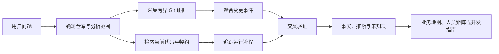
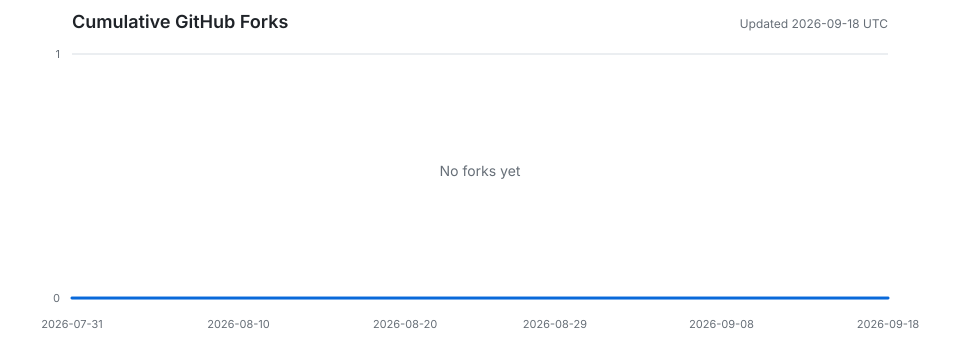

# Git Project Intelligence

[简体中文](README.md) | [English](README.en.md)

`git-project-intelligence` 是一个面向 Codex 的 Git 仓库分析技能。它把当前代码、提交历史、测试、配置和文档组合成可核验的证据，用于还原项目架构、业务流程、技术决策、贡献者知识分布，以及产品或技术方案与现有项目的适配程度。

它的目标不是生成一份“提交次数排行榜”，而是回答更有工程价值的问题：

- 一个陌生项目从哪里开始读，核心模块如何协作？
- 某项业务能力从 UI、API 或任务入口到最终副作用，经过了哪些状态和边界？
- 某次改动为什么触及这些模块，当前代码是否仍保留这套设计？
- 哪些贡献者在特定子系统中有可观察的历史经验？知识是否过度集中？
- 一位贡献者通常如何定位入口、划分改动边界、处理兼容性和验证结果？
- 一个新需求是适合直接实现、需要调整、应先验证，还是与现有约束冲突？
- 下一位开发者应修改哪些文件、遵守哪些不变量、补充哪些测试？

> Git 是历史证据，但不是完整事实。本技能会区分事实、推断和未知项，并要求关键结论附带提交、路径、符号或命令依据。

## 核心能力

### 项目与架构理解

- 盘点顶层模块、构建清单、运行入口、依赖注入、领域模型、持久化、外部适配器和测试。
- 从当前代码还原实际运行行为，以 Git 历史补充设计意图和演进背景。
- 将相关提交聚合为“变更事件”，而不是机械罗列提交记录。
- 使用 Mermaid 时序图和流程图表达组件交互、决策、失败与回退路径。

### 业务入口发现

- 从用户使用的产品词汇出发，扩展角色、实体、动作、状态、错误、UI 文案、API 字段、事件和配置键。
- 联合搜索当前代码、文件名、提交消息和历史 diff。
- 根据证据是否跨越 UI/API、领域状态、持久化、副作用和测试来排序候选入口，而不是只按命中次数排序。
- 输出业务术语在仓库中的实际含义、端到端流程、相邻概念和仍待确认的问题。

### 贡献者与团队知识分析

- 按子系统评估贡献者的可观察知识覆盖：`deep`、`working`、`adjacent` 或 `insufficient evidence`。
- 综合变更广度、重复深度、生命周期覆盖、近期连续性、跨模块集成和代码存续情况。
- 分析代表性变更事件中的模块边界、依赖顺序、兼容策略、失败处理和验证习惯。
- 识别知识集中、单一维护者、低测试覆盖和所有权不清等仓库风险。

该能力描述的是**仓库中可观察到的工程经验**，不等同于个人的全部能力、当前组织职责或实际可用性，也不会从提交数量推断生产力、资历、性格或动机。

### 方案与需求评估

- 先还原当前工作流，再比较需求带来的状态、契约、平台、数据和运维变化。
- 从架构适配、正确性、兼容性、可靠性、安全、性能、可测试性、维护成本和可逆性等维度检查方案。
- 对产品需求给出定性结论：`fits`、`fits with adjustments`、`validate first` 或 `conflicts`。
- 对历史技术方案给出 `sound`、`viable with tradeoffs`、`fragile or context-dependent`、`superseded` 或 `insufficient evidence`。
- 建议最小可逆实验、验收标准、回归面以及发布和回滚边界。

### 开发导航

- 给出最可能的代码入口、所属模块、调用/数据流和相似历史实现。
- 明确必须维护的不变量、兼容约束、待扩展测试和验证命令。
- 将分析结果转换成带风险检查点的最小实现顺序。

## 工作原理



分析遵循两个优先级：

1. **当前行为以当前代码为准。** 入口、状态变化、失败路径和副作用需要通过现有实现及测试确认。
2. **设计意图和演进以历史为证据。** 提交说明、diff、父版本和后续修复可解释变化，但不能替代当前代码。

当两者不一致时，报告应显式说明差异及其影响。

## 目录结构

```text
git-project-intelligence/
├── .github/
│   └── workflows/
│       └── update-fork-trend.yml
├── SKILL.md
├── README.md
├── README.en.md
├── assets/
│   └── fork-trend.svg
├── agents/
│   └── openai.yaml
├── references/
│   ├── business-product-analysis.md
│   ├── contributor-engineering-analysis.md
│   └── report-contract.md
└── scripts/
    ├── collect_git_evidence.py
    ├── find_business_context.py
    └── update_fork_trend.py
```

| 路径 | 作用 |
| --- | --- |
| `SKILL.md` | 技能入口，定义适用场景、证据原则、分析流程和输出模式。 |
| `agents/openai.yaml` | Codex 界面展示名称、简介和默认提示词。 |
| `references/report-contract.md` | 完整仓库/团队报告的章节结构和证据标注约定。 |
| `references/business-product-analysis.md` | 业务关键词扩展、入口排序和产品适配评估规范。 |
| `references/contributor-engineering-analysis.md` | 贡献者知识、技术决策、模块修改方式和方案可行性分析规范。 |
| `scripts/collect_git_evidence.py` | 以有界、只读方式汇总提交、作者、文件热度和 numstat，输出 JSON。 |
| `scripts/find_business_context.py` | 联合 `rg` 与 Git 历史查找业务关键词相关的代码、文件和提交，输出 JSON。 |
| `scripts/update_fork_trend.py` | 获取完整 Fork 历史并生成从仓库创建日至当前日期的累计 SVG 趋势图。 |
| `.github/workflows/update-fork-trend.yml` | 每 6 小时或手动触发趋势图更新，并在内容变化时提交新图。 |
| `assets/fork-trend.svg` | README 使用的自动生成 Fork 趋势图。 |

## 环境要求

- Git
- Python 3.8 或更高版本，仅使用标准库
- [ripgrep](https://github.com/BurntSushi/ripgrep)（仅 `find_business_context.py` 必需）
- 支持本地技能的 Codex 环境

两个辅助脚本都只读取目标 Git 仓库；只有传入 `--output` 时才会写入指定的 JSON 文件。它们不会修改目标仓库、切换分支或创建提交。

## 安装

将本仓库放入 Codex 的个人技能目录，并确保目录名为 `git-project-intelligence`：

```bash
git clone https://github.com/skeyboy/git-project-intelligence.git \
  ~/.codex/skills/git-project-intelligence
```

重新打开 Codex 会话后，可以在提示词中显式调用：

```text
使用 $git-project-intelligence 分析当前仓库，给我一份新开发者快速导览。
```

也可以直接提出符合技能描述的问题；显式写出 `$git-project-intelligence` 更便于确认使用的是本技能及其证据规范。

如果已将仓库检出到其他位置，可创建指向该目录的符号链接：

```bash
ln -s /absolute/path/to/git-project-intelligence \
  ~/.codex/skills/git-project-intelligence
```

## 快速开始

在要分析的 Git 仓库中打开 Codex，然后选择最贴近目标的提示词。

### 1. 快速了解陌生项目

```text
使用 $git-project-intelligence 分析当前分支。请给出架构地图、一个核心运行流程、
高风险或高变更区域，以及新开发者最先应阅读的文件。区分事实、推断和未知项。
```

### 2. 追踪一次变更如何运行

```text
使用 $git-project-intelligence 分析提交 <commit>：说明它所属的变更事件、涉及的模块、
运行时调用顺序、状态与失败路径、相关测试、后续修复和当前代码中的存续情况。
用 Mermaid 时序图和流程图展示。
```

### 3. 从产品词汇定位业务代码

```text
使用 $git-project-intelligence 查找“自动续费”在当前项目中的业务入口。
从 UI/API 触发点追踪到领域状态、持久化和外部副作用，列出 3-7 个最关键入口、
相关测试与代表性提交，并说明仍有哪些歧义。
```

### 4. 分析团队知识分布

```text
使用 $git-project-intelligence 分析最近 18 个月的贡献者知识分布。
排除机器人、合并提交、生成文件和纯格式化改动；按子系统给出定性覆盖与置信度，
识别知识集中风险，不要按提交数评价个人。
```

### 5. 分析贡献者的模块修改方式

```text
使用 $git-project-intelligence 分析 <author> 在支付模块中的工程实践。
至少采样 3 个完整变更事件，归纳入口定位、模块边界、改动顺序、兼容性、失败处理、
测试和后续修复；提供反例、样本范围和置信度，不推断性格或私人动机。
```

### 6. 评估新需求

```text
使用 $git-project-intelligence 评估“<requirement>”是否适合当前项目。
先还原现有流程，再给出 fits / fits with adjustments / validate first / conflicts 结论，
说明证据、反证、假设、最小可逆实验、验收标准、回归范围和可能的代码入口。
```

### 7. 为开发任务生成导航包

```text
使用 $git-project-intelligence 为“<feature or bug>”生成开发导航包：包含入口文件与符号、
端到端调用和数据流、相似历史提交、不变量、需要扩展的测试、验证命令，以及分阶段实现顺序。
```

## 辅助脚本

技能通常会自动调用脚本采集证据。也可以单独运行它们，用于调试、审计或把 JSON 接入其他工具。

### `collect_git_evidence.py`

对指定 revision 的提交记录进行有界采集，汇总作者、文件触达次数、每次提交的 numstat 和基础仓库信息。

```bash
python3 scripts/collect_git_evidence.py \
  --repo /path/to/repository \
  --revision main \
  --since 2025-01-01 \
  --until 2025-12-31 \
  --path src/payments \
  --path tests/payments \
  --max-commits 1000 \
  --top 30 \
  --output /tmp/git-evidence.json
```

| 参数 | 默认值 | 说明 |
| --- | --- | --- |
| `--repo` | `.` | 目标仓库中的任意路径。脚本会解析实际仓库根目录。 |
| `--revision` | `HEAD` | 要分析的 revision，可为分支、标签或 commit。 |
| `--since` | 无 | 传递给 `git log --since` 的起始时间。 |
| `--until` | 无 | 传递给 `git log --until` 的结束时间。 |
| `--path` | 无 | 路径过滤，可重复传入。 |
| `--max-commits` | `2000` | 最大提交数，至少按 1 处理。 |
| `--top` | `50` | 作者常触达文件和全局高频文件的最大条目数。 |
| `--output` | 标准输出 | JSON 输出路径。 |

输出的顶层字段包括：

- `repository`、`revision`、`head`、`branch`、`shallow`
- `filters` 和实际收集到的 `commit_count`
- `authors`：未经别名合并的作者统计及其常触达文件
- `hot_files`：在采样提交中出现频率较高的文件
- `commits`：提交元数据及逐文件新增/删除行数
- `caveats`：别名、重命名检测和行数解释等固定限制

注意：脚本为保持结果有界且确定，显式关闭 rename detection；二进制文件的行数记为 0。作者别名、机器人、生成文件和机械改动需要在后续分析阶段识别，不能直接根据原始统计得出人员结论。

### `find_business_context.py`

从一个或多个业务关键词出发，搜索当前代码、文件名、提交消息和 diff 内容。

```bash
python3 scripts/find_business_context.py \
  --repo /path/to/repository \
  --keyword "subscription" \
  --keyword "renewal" \
  --revision main \
  --max-files 40 \
  --max-commits 50 \
  --samples-per-file 3 \
  --output /tmp/business-context.json
```

| 参数 | 默认值 | 说明 |
| --- | --- | --- |
| `--repo` | `.` | 目标仓库中的任意路径。 |
| `--keyword` | 必填 | 固定字符串关键词，可重复传入；空值会被忽略，重复值会去重。 |
| `--revision` | `HEAD` | 当前历史搜索范围和输出中的目标 HEAD。 |
| `--all-branches` | 关闭 | 搜索所有分支，而不是仅搜索 `--revision`。 |
| `--max-files` | `50` | 返回的代码和文件名候选上限。 |
| `--max-commits` | `30` | 提交消息、diff 两类结果各自的上限。 |
| `--samples-per-file` | `3` | 每个文件保留的代码匹配样本数。 |
| `--output` | 标准输出 | JSON 输出路径。 |

脚本使用 `rg --fixed-strings --ignore-case` 搜索当前工作树，并排除 `.git`、`node_modules`、`dist` 和 `build`。历史部分分别使用 `git log --grep` 和 `git log -G` 搜索提交消息及 diff。

输出包括 `current_code_matches`、`filename_matches`、`commit_message_matches` 和 `diff_content_matches`。这些结果只是候选入口：生成代码、vendored 文件、本地化资源、过期文档或死代码都可能排名靠前，必须继续追踪实际运行流程后才能形成业务结论。

## 分析流程

一次完整分析通常按以下顺序执行：

1. **确定范围**：确认仓库根目录、revision、时间窗口、路径、贡献者和预期输出；检查工作树和浅克隆状态。
2. **采集基线**：运行 `collect_git_evidence.py`，再用 `git show`、`git log --follow`、`git blame -w`、`git log -S/-G` 做针对性补充。
3. **还原演进**：按时间、共享文件/符号、问题编号和依赖关系聚合变更事件，检查前置重构、实现、测试和后续修复。
4. **映射当前结构**：识别入口、领域逻辑、状态、持久化、外部系统、后台任务和测试边界。
5. **追踪工作流**：从用户或系统触发点追踪到结果、副作用、错误、重试、回滚和清理。
6. **交叉验证**：用测试、契约、配置、文档和历史验证关键解释，并主动寻找反证。
7. **形成结论**：明确标注事实、推断、未知项、置信度和能改变当前判断的新证据。
8. **转为行动**：按需求输出架构导览、开发导航、团队知识风险、方案修正或最小实验。

## 输出模式

| 模式 | 适用问题 | 主要内容 |
| --- | --- | --- |
| Quick orientation | 快速接手陌生仓库 | 架构地图、核心流程、热点、阅读顺序。 |
| Commit flow | 某次提交如何改变系统 | 变更事件时间线、时序图、流程图、测试和风险。 |
| Business map | 项目支持哪些业务能力 | 能力、工作流、模块、关键符号、测试和代表性提交。 |
| Keyword brief | 产品词汇对应哪些代码 | 关键词簇、仓库含义、候选入口、相关概念和未知项。 |
| Product fit review | 新需求是否适配 | 当前/目标流程差异、适配结论、修正建议和验证实验。 |
| Team knowledge map | 团队知识如何分布 | 贡献者-子系统矩阵、证据、置信度和集中风险。 |
| Contributor engineering profile | 某贡献者如何修改模块 | 技能证据、决策假设、改动策略、方案可行性和协作建议。 |
| Developer packet | 下一步如何实现功能或修复缺陷 | 入口、调用流、历史类比、不变量、测试和实施顺序。 |
| Full report | 系统性仓库或团队审计 | `report-contract.md` 定义的完整报告。 |

完整报告可按问题裁剪，但通常包括范围与证据、执行摘要、项目结构、演进事件、运行流程、业务能力、需求适配、贡献者知识矩阵、技术决策与修改策略、方案可行性、工程模式、风险以及开发者快速开始。

## 证据与伦理边界

本技能刻意约束结论的强度：

- **事实**应能指向当前代码、测试、配置、提交或可复现命令。
- **推断**必须说明观察依据、可能的替代解释和置信度。
- **未知项**不能用仓库之外的臆测补齐。
- 提交次数、增删行数和文件数只用于描述采样，不代表价值、效率、资历或理解程度。
- 合并、rebase、squash、作者别名、机器人、AI 辅助、生成代码、vendored 代码和格式化改动都会扭曲表面统计。
- 历史作者不自动等于当前 owner、组织负责人或可联系的 reviewer。
- “工程画像”仅描述可观察的技术领域、决策模式、权衡、验证方式和协作含义，不推断身份、性格、智力、动机、健康或其他私人属性。
- 产品代码可以证明现有行为和约束，不能单独证明用户需求或商业价值。

每份正式报告都应以限制与复现信息结尾，至少记录：仓库 revision、分析范围、时间和路径过滤、排除项、浅克隆状态，以及使用过的命令或脚本参数。

## 常见问题

### 为什么不直接根据提交数判断“谁最懂”？

提交数量容易被拆分习惯、合并方式、生成文件、格式化、机器人和历史迁移影响。本技能要求结合多次实质性变更、跨层集成、测试、修复、近期连续性和当前代码存续情况，并用定性覆盖与置信度表达。

### 为什么关键词命中不能直接当作业务入口？

一个词可能出现在本地化、测试夹具、生成代码、废弃模块或文档中。可靠入口通常需要多层证据汇合，例如 UI/API 触发、领域状态、持久化、副作用和测试同时指向同一条运行路径。

### 浅克隆可以分析吗？

可以分析当前代码，但历史结论会受限。报告应标记 `shallow: true` 并降低演进、贡献者覆盖和早期设计意图相关结论的置信度。如需完整历史，应先在允许的情况下补全克隆。

### 脚本会修改被分析的仓库吗？

不会。脚本执行只读 Git 和搜索命令。指定 `--output` 时只写入该路径；建议将临时结果放在 `/tmp` 或仓库之外。

### 可以只分析一个目录或时间段吗？

可以。基线脚本支持重复的 `--path`、`--since`、`--until` 和 `--revision`。向 Codex 提问时也应明确相同范围，避免把局部证据泛化到整个项目或贡献者的全部历史。

## 故障排查

### `fatal: not a git repository`

`--repo` 必须指向目标仓库根目录或其内部目录。先运行：

```bash
git -C /path/to/repository rev-parse --show-toplevel
```

### `rg is required for current-code discovery`

安装 ripgrep 并确认 `rg` 在 `PATH` 中。`collect_git_evidence.py` 不依赖 `rg`，仍可单独使用。

### 历史结果过多或分析缓慢

优先缩小 `--revision`、`--since`、`--until` 和 `--path` 范围，并降低 `--max-commits`。先看摘要，再对少量代表性和边界变化提交使用针对性 Git 命令。

### 作者看起来重复

`collect_git_evidence.py` 按 Git 中的作者姓名和邮箱原样分组，不自动合并别名。正式人员分析需要基于 `.mailmap`、明确身份映射或可核验证据进行保守归一化，并记录不确定性。

## 开发与验证

本项目的 Python 脚本仅依赖标准库。修改后可先执行语法检查和帮助输出：

```bash
python3 -m py_compile scripts/collect_git_evidence.py scripts/find_business_context.py scripts/update_fork_trend.py
python3 scripts/collect_git_evidence.py --help
python3 scripts/find_business_context.py --help
```

再用本仓库做最小冒烟测试：

```bash
python3 scripts/collect_git_evidence.py \
  --repo . --max-commits 20 --output /tmp/git-evidence.json

python3 scripts/find_business_context.py \
  --repo . --keyword "contributor" --output /tmp/business-context.json
```

检查输出时，至少确认 JSON 可解析、HEAD 与目标 revision 一致、过滤范围被记录、结果数量受参数限制，并保留 `caveats` 中的解释边界。

## 项目状态

当前实现聚焦于可复现的只读证据采集和严格的分析规范。辅助脚本负责生成候选证据，不会替代对当前运行代码、测试、历史上下文和反证的人工或智能分析。

欢迎通过 Issue 或 Pull Request 补充新的分析场景、报告契约、边界测试和跨平台验证。新增能力应保持以下原则：结果有界、命令只读、证据可复现、事实与推断分离，并避免将 Git 统计变成人员评价。

## Fork 趋势

[](https://github.com/skeyboy/git-project-intelligence/network/members)

趋势图从仓库创建日开始，依据 [GitHub REST API](https://api.github.com/repos/skeyboy/git-project-intelligence/forks?per_page=100&sort=oldest) 中每个 Fork 的创建时间累计统计。GitHub Actions 每 6 小时自动获取完整分页数据并更新图表，也可通过 `Update fork trend` 工作流手动刷新。

[](https://github.com/skeyboy/git-project-intelligence/network/members)

## License

仓库当前未包含许可证文件。在许可证明确之前，请勿假定本项目允许复制、修改或再分发；如需使用或贡献，请先与仓库维护者确认授权范围。
