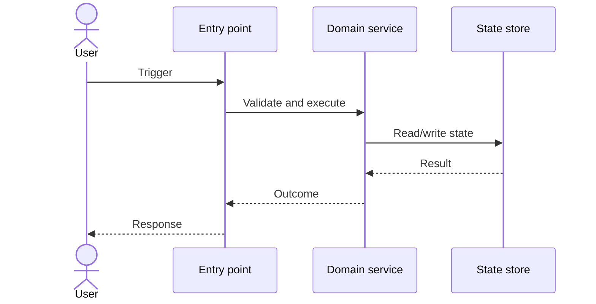
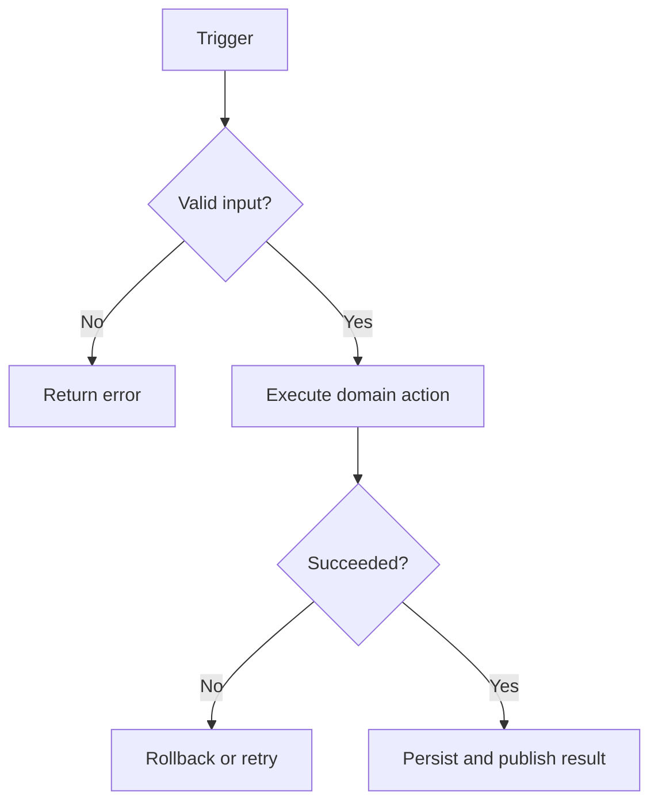

# Report Contract

Use this structure for a full analysis. Omit empty sections for focused requests.

## 1. Scope and evidence

Record repository, HEAD, branch/revision range, dates, path filters, shallow-clone status, author normalization, bot/generated/vendor exclusions, and analysis commands.

## 2. Executive findings

Give 5-10 high-signal findings. Label each `Fact`, `Inference`, or `Unknown` and include evidence references.

## 3. Project structure

Map directories/modules to technical responsibility, business capability, entry points, dependencies, persistence/external systems, and tests. Distinguish architectural layers from business domains.

## 4. Evolution and commit episodes

Group related commits into episodes rather than listing every commit. For each episode include intent, commits, files/symbols, dependency order, runtime effect, tests, and residual risk.

## 5. Runtime workflows

For each important workflow state: trigger, actors/components, inputs, decisions, state changes, side effects, failures/retries, outputs, and verifying tests.

Use a sequence diagram for participant interaction:

Use a flowchart for decisions and failures:

## 6. Business capability map

Connect business capability -> workflow -> module -> key symbols -> tests -> representative commits. Flag capabilities inferred only from names or code when product documentation is absent.

For keyword-driven questions, include the original phrase, expanded keyword constellation, confirmed repository meaning, ranked entry points, adjacent concepts, and unresolved ambiguity.

## 7. Product requirement fit

When evaluating a product idea, include:

- normalized problem, actor, trigger, outcome, constraints, and success measure;
- current workflow and proposed workflow delta;
- reusable capabilities and missing capabilities;
- affected states, contracts, platforms, data, operations, and owners;
- verdict: `fits`, `fits with adjustments`, `validate first`, or `conflicts`;
- evidence, counterevidence, assumptions, confidence, and conditions that change the verdict;
- recommended correction, smallest experiment, acceptance criteria, telemetry, regressions, and rollback.

## 8. Contributor knowledge matrix

Use rows for contributors and columns for subsystems. Each cell contains coverage level plus confidence, never a numeric performance score.

Coverage evidence may include substantive commits, survived code, tests, cross-module integration, fixes, operational changes, and recency. Discount merges, generated/vendor churn, formatting-only commits, and raw line counts. List aliases and uncertainty.

## 9. Contributor technical reasoning and module change strategies

For each contributor, sample coherent change episodes and report:

- demonstrated technical and domain skills;
- visible problem framing and constraints;
- typical entry points, module boundaries, dependency order, and state or contract handling;
- local-change versus abstraction choices;
- compatibility, failure, observability, validation, rollout, and follow-up patterns;
- explicit rationale versus inferred rationale and unknowns;
- counterexamples, sample size, date range, and confidence.

Call this observed technical reasoning or an engineering profile, never direct access to private thought.

## 10. Representative solution feasibility

Evaluate 1-3 representative solutions per contributor when evidence permits. Give a qualitative verdict (`sound`, `viable with tradeoffs`, `fragile or context-dependent`, `superseded`, or `insufficient evidence`) for the historical context and current code. Cover architecture fit, correctness, compatibility, reliability, security/privacy where relevant, performance, operability, testability, maintainability, delivery complexity, and reversibility. Include evidence that could change the verdict.

## 11. Observable engineering patterns and profile

For each contributor give: pattern hypothesis, supporting examples, counterexample/alternative explanation, sample size, confidence, and practical collaboration implication. Avoid personality labels and rank ordering.

Summarize the engineering persona only as demonstrated skills, recurring decision patterns, tradeoffs, validation habits, current-code survival, and collaboration implications. Do not infer character, intelligence, seniority, motives, or private traits.

## 12. Risks and knowledge gaps

Cover single-owner areas, abandoned subsystems, weak tests, undocumented boundaries, high-churn files, ownership ambiguity, and history limitations. Distinguish repository risk from personnel judgment.

## 13. Developer quick-start

Provide the reading order, local build/test commands, trace points, analogous changes, likely files to modify, invariants, and a staged implementation plan for the requested task.

## Evidence notation

Prefer compact references:

- commit: `abc1234 subject (YYYY-MM-DD)`;
- code: `path/to/file.ext:line` or `symbol()`;
- confidence: `high`, `medium`, `low` with one-sentence rationale;
- inference: explicitly state what observations support it and what else could explain them.
